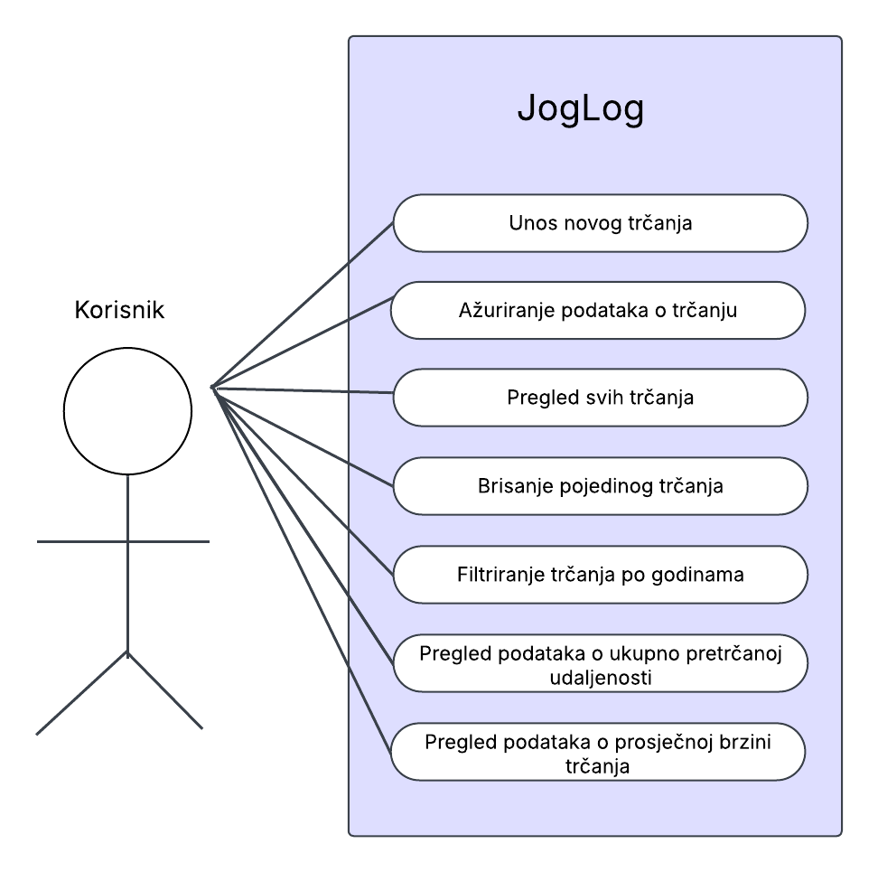

## Opis
JogLog je web aplikacija za praćenje trkačkih aktivnosti korisnika koja omogućuje unos, ažuriranje, pregled i brisanje trkačkih zapisa. 

Kao dodatne funkcionalnosti nudi se filtriranje trčanja po godinama te prikaz ukupne pretrčane udaljenosti i prosječne brzine po mjesecima unutar neke godine.

Korištene tehnologije za frontend su HTML, CSS, Bootstrap i Chart.js, dok su Python (Flask), Jinja, PonyORM i SQLite odgovorni za backend.

## Use case dijagram

## Pokretanje aplikacije pomoću Dockera
#### Kloniranje repozitorija
`git clone https://github.com/petra-tuskan/JogLog.git`
######
`cd JogLog`

#### Stvaranje Docker image-a
`docker build --tag joglog:1.0 .`

#### Pokretanje kontejnera
`docker run -p 5001:8080 joglog:1.0`

#### Aplikacija je dostupna na `localhost:5001`
